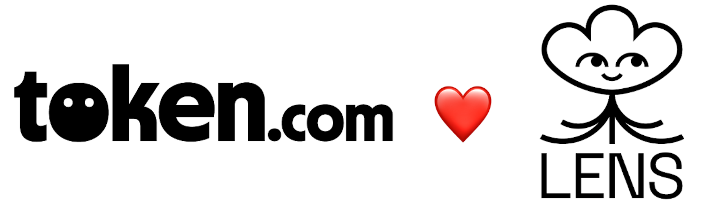

# Social investing using Lens x Token.com



Our tool can filter Lens posts by keywords. Usecase: by filtering for token tickers (ex. AAVE, UNI) we can allow Token.com users to discover & invest in the tokens that Lens users are talking about.

## Usage

This project is intended to be consumed by other front-end apps and widgets by calling the folowing URL:

```
https://ethprague-lens-hackathon.herokuapp.com/publications?symbols=eth,aave,op
```

You can also call this via curl:

```console
curl --get https://ethprague-lens-hackathon.herokuapp.com/publications --data-urlencode "symbols=aave,eth,arb,op,matic"
```

## Getting Started

**Install the project**

```console
gh repo clone tokenweb3-ethprague/social-investing-hackathon
cd social-investing-hackathon
npm i
```

**Configure your GCP credentials**

> Note: this project fetches Lens data from BigQuery. In order to run it locally, you'll need your own GCP credentials with accrss to BQ.

Your GCP keyfile should look like this:

```json
{
  "type": "service_account",
  "project_id": "",
  "private_key_id": "",
  "private_key": "",
  "client_email": "",
  "client_id": "",
  "auth_uri": "",
  "token_uri": "",
  "auth_provider_x509_cert_url": "",
  "client_x509_cert_url": "",
  "universe_domain": ""
}
  ```

**Make a new `.env` file**

```console
cp .env.example .env
```

Your

**Then stringify your GCP keyfile, and set it as the value to the `BIGQUERY_CREDENTIALS` key**

```file
BIGQUERY_CREDENTIALS=<your_stringified_keyfile>
```

**Start the server**

```console
npm build
npm start
```
